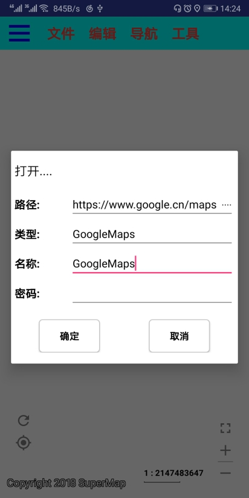
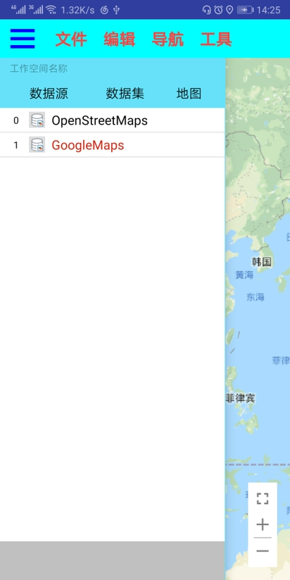
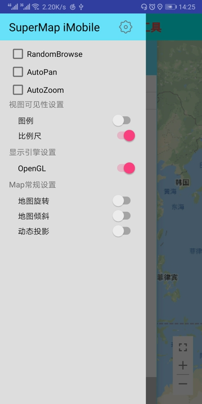
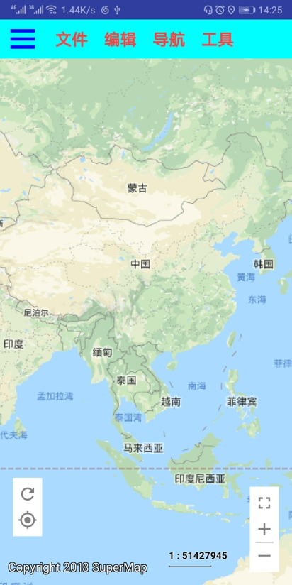

# SuperMapiMobile

#### Description
       本应用是基于SuperMap iMobile for Android 产品开发的Android应用。
	   它是为了方便对SuperMap iMobile for Android产品进行常用功能测试而开发的，以二维数据和地图为主，后期考虑加入三维功能。

应用主要功能:
1. 支持打开离线工作空间(smwu等)、udb数据源、sci缓存、影像文件(tif等)；
2. 支持访问iServer Rest，WMTS，BingMap, GoogleMap，天地图等在线地图服务；
3. 支持点、线、面绘制和编辑，以及拓扑编辑；
4. 支持距离测量、面积测量；
5. 支持配置导航数据，提供导航功能；
6. 提供数据源与数据集列表，可以将数据集添加到地图；
7. 提供图层列表，可以控制图层显示与隐藏，移除图层等；
8. 支持创建工作空间和数据集，保存地图和保存工作空间；
9. 支持地图动态投影设置和OpenGL显示引擎关闭与打开；

#### Develop Enviroment
本应用使用Andorid Studio 3.2开发

#### 项目地址
1. [Github: SuperMapiMobile](https://github.com/Jun0x01/SuperMapiMobile), 原始项目。
2. [Gitee码云: SuperMapiMobile](https://gitee.com/Jun0x01/SuperMapiMobile), 同步自Github的项目，下载速度较好。
### 应用截图
1. 打开谷歌地图
   
   
2. 工作空间数据查看
   
   
3. 应用设置
   
   
4. 谷歌地图显示
   
   
